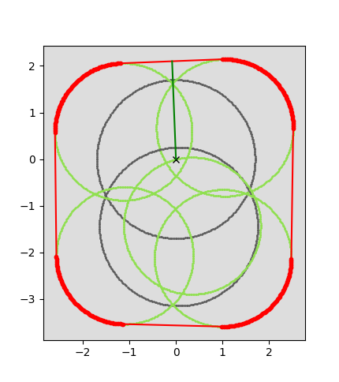
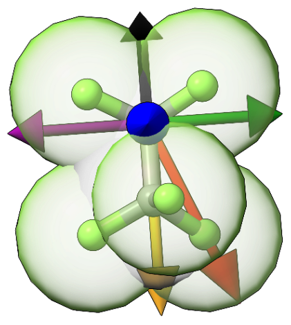
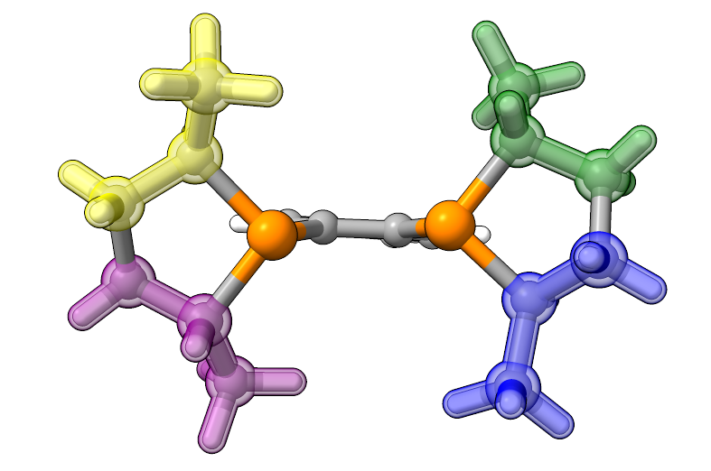
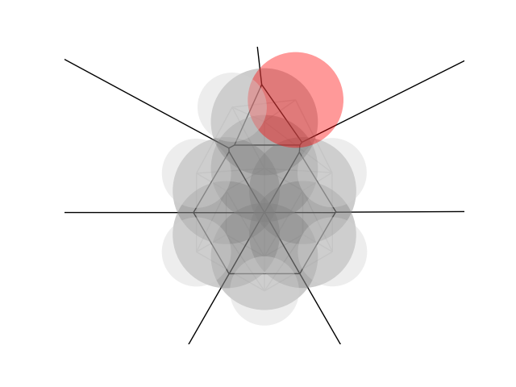
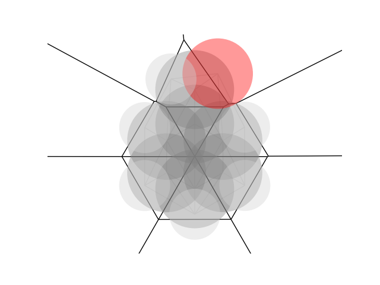

Structure Analysis and Descriptor Implementation
================================================

This page has information about the AaronTools implementation of several algorithms.
Although more information might be available in the original publications, this is here in case AaronTools users who are interested in how these methods are implemented.
Some methods might have ambiguities which could lead different software packages to produce different numbers.

Sterimol
--------
Sterimol B\ :sub:`5` and L are determined analytically (unless the user writes a function to define L in a numerical way).
The procedure for the L parameter is to take each vector from the substituent atom that is bonded to the rest of the molecule to one other substituent atom.
These vectors are projected onto the L-axis, and the atom's van der Waals (VDW) radius is added.
Depending on what the user requests, a correction may also be added (e.g. a correction of 0.4 + the ideal Z-H bond length, where Z is the element of the substituent's starting atom).

The B\ :sub:`5` parameter is found by taking the distance from the L-axis vector to each substituent atom and adding each atom's VDW radius.
The longest of these is the B\ :sub:`5`.

The B\ :sub:`1` parameter is determined numerically.
To determine B\ :sub:`1`, atom coordinates are projected onto a plane orthogonal to the L-axis.
A circle of points centered on each atom's coordinates are placed on the plane.
The circle's radius is the atom's van der Waals radius.
Next, the convex hull of these points is found.
B\ :sub:`1` is the perpendicular distance from the L-axis to the closest face of the convex hull.
Finally, the widths opposite and perpendicular to B1 are determined and sorted into B\ :sub:`2`-B\ :sub:`4`.

This diagram shows how the Sterimol B\ :sub:`1` is determined for a perfluoroethyl substituent.
Red points are vertices of the convex hull - red lines show the faces.
Gray and green points are points on the circle for carbon or fluorine atoms, respectively.
The L axis is indicated with the 'x' in the middle, and the green line from the x to a face is the B\ :sub:`1` width.
The 3D version shows the B\ :sub:`1` as a black arrow.

Differences from Verloop's procedure
^^^^^^^^^^^^^^^^^^^^^^^^^^^^^^^^^^^^

Unlike the original implementation, AaronTools uses a structure provided by the user.
If the B\ :sub:`1` width only depends on a substituent atom that is on the L-axis (e.g. a methoxy substituent), AaronTools can produce different results from the original for B\ :sub:`2`-B\ :sub:`4`.
This is because of the infinite ways to orient the substituent's bounding box and still get the same B\ :sub:`1` value.

AaronTools does not currently allow users to use the same radii as the original program via the command line script.

Sterimol2Vec
^^^^^^^^^^^^

The Sterimol2Vec parameters are determined by taking atoms within their van der Waals diameter of the desired L coordinate.
The radii of these atoms are adjusted to the radius of the circle formed by the intersection of the VDW radius with the plane orthogonal to the L-axis passing through the L coordinate.
Then, the coordinates of those atoms are simply set to the L coordinate.
Atoms that are more than one VDW diameter from the desired L coordinate are ignored.
The B\ :sub:`1`-B\ :sub:`5` parameters are then determined by the usual method.

Cone Angles
-----------

Tolman's cone angle for unsymmetrical ligands
^^^^^^^^^^^^^^^^^^^^^^^^^^^^^^^^^^^^^^^^^^^^^^

For this method, the cone angles of each group coming off of the coordinating elements are averaged.
If the group is a bridge between two coordinating atoms (bidentate ligands only), the cone angle for that group is simply half the L-M-L angle.
If the group contains a ring that loops back to the ligating atom (e.g. the five-membered rings on DuPhos), the ring is cut in half and treated as two separate groups.

The below image shows how rings are split for a DuPhos ligand.
Sections of the ring are colored based on how they are grouped into a substituent. 

Differences from Tolman's procedure
***********************************

AaronTools does not enforce Tolman's 2.28 Å M-L bond length.
Of course, the user could provide structures with a 2.28 Å M-L bond length.
AaronTools uses structures provided by the user as-is, so substituents on the coordinating atoms are not rotated to minimize the cone angle.
Tolman's formula also says to divide the sum of the cones for each substituent on the coordinating atom by 3.
We assume this is because Tolman was working with phosphine ligands, so our method of averaging the cone angle for substituents on the coordinating atom(s) will give different results than the formula implies for ligands with more or less saturated coordinating atoms (e.g. N-heterocyclic carbenes).

In short, the original Tolman cone angle formula is

.. math::
    
    \theta_{Tolman} = \sum_{L}^{coord.\:atoms}\frac{2}{3}\sum_{j}^{N_{bonds}^{L}}\frac{\theta_j}{2}

And the formula we use is

.. math::
    
    \theta_{Tolman}^{AaronTools} = \sum_{L}^{coord.\:atoms}\frac{2}{N_{bonds}^{L}}\sum_{j}^{N_{bonds}^{L}}\frac{\theta_j}{2}

Where :math:`\theta_j` is the angle for the smallest cone that fits the group coming off atom L, with the cone's axis fixed to the M-L bond.
For polydentate ligands, the :math:`\theta_j` for the group that bridges coordinating atoms is the L-M-L angle.
:math:`N_{bonds}^{L}` is the number of bonds on one of the coordinating atoms.

Condensed Fukui
---------------

Often times, condensed Fukui values are calculated by calculating partial atomic charges (e.g. Mulliken charges) for the molecule in question, and then calculating the partial atomic charges for the molecule with an electron added or removed.
Instead of this, AaronTools integrates the orbital-weighted Fukui functions (see https://doi.org/10.1002/jcc.24699 for weighting scheme) in an area around each atom.

The condensed Fukui values are calculated by integrating the Fukui acceptor or donor functions over the Laguerre–Voronoi cells of each atom.
The Laguerre–Voronoi cells differ from normal Voronoi cells in that they are larger for atoms with larger VDW radii relative to that of their neighbors.
Where a Voronoi cell encompasses all points that have the smallest distance to one atom/node than any other, the Laguerre–Voronoi cells are partitioned based on the smallest d\ :sup:`2`-r\ :sup:`2`, where d is the distance from the point to an atom and r is the VDW radius of the atom.
Below is a 2-D depiction of a Voronoi (top) and Laguerre-Voronoi (bottom) tessellation of benzaldehyde:

