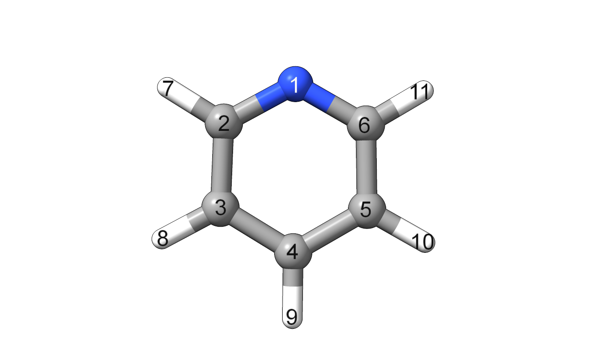

multiSubstitute.py
==================

.. include:: multiSubstitute_help.txt

Examples
--------

Let's say we want to generate a library of substituted pyridines.
Here's the numbering for our starting pyridine structure:

For this example, we'll be keeping positions numberd 7 and 11 the same as each other,
and independently modifying position 9.

Here's a command we can use to do this:

.. code-block:: text

    multiSubstitute.py pyridine.xyz -s 7,11=iupac:butyl,iupac:propyl,Et,Me,H -s 9=F,Cl,Br,CH2F,CHF2,CF3,NO2,iupac:acetyl,OMe,SMe,Me -o pyridines\$INFILE_$SUBSTITUTIONS.xyz

This command generates 55 structures.
If 7 and 11 are modified independently but still use the same list of substituents
(`i.e.` :code:`-s 7=... -s 11=...`), it will generate 275 structures.
Keep combinatorial explosions in mind when generating your libraries!