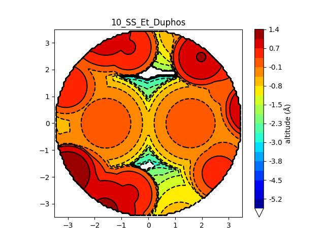
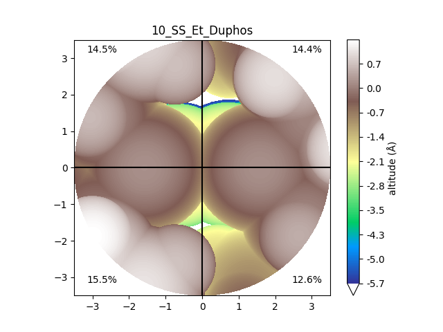

stericMap.py
============

.. include:: stericMap_help.txt

Gallery
-------

steric map with the default settings

steric map with modified settings (:code:`-nl -l 500 -cmap terrain -n 1000 -vbur`)

A list of color maps in Matplotlib can be found `here <https://matplotlib.org/stable/gallery/color/colormap_reference.html>`_.
The structures for the gallery images are taken from
`DOI 10.1021/jacs.2c08513 <https://doi.org/10.1021/jacs.2c08513>`_