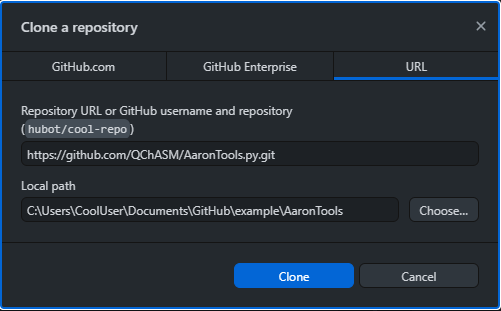

Installation Guide
==================

Requirements
-------------

* Python 3.x
* SciPy ≥ 0.13.x 

Recommended
------------

* RDKit - AaronTools can utilize RDKit (if installed) to generate molecular structures (*i.e.* with the fetchMolecule command line script or the :code:`from_string` methods of the :code:`Geometry`, :code:`Substituent`, or :code:`Ring` classes). Without RDKit, it falls back to the CATCVS database.
* jinja2 - For parsing template files used in job submission routines
* pdfminer and pdfminer.six - The PDFparse command line script uses these to grab structures from PDF files. 
* matplotlib - Plotting simulated spectra (IR, Raman, UV/Vis, etc.)

Any OS, using pip
------------------

.. code-block:: bash
    
    pip install AaronTools

You may need to add your Python scripts directory to your :code:`PATH` environment
variable to use AaronTools command line scripts. Examples of setting environment variables
can be found in the OS-dependent installation instructions.
The scripts directory is typically in the same location as your python installation.
One way to find this is by running:

.. code-block:: bash

    python -c "import sys; import os; print(os.path.dirname(sys.executable))"

Install with optional dependencies
^^^^^^^^^^^^^^^^^^^^^^^^^^^^^^^^^^

.. code-block:: bash

    pip install "AaronTools[extras]"

Security/External Connections
^^^^^^^^^^^^^^^^^^^^^^^^^^^^^^^

Unless RDKit is installed and accessible, AaronTools will try to connect to external servers for
the generation of structures from IUPAC names and SMILES.
To **disable all remote connections** set

    local_only = True

in $QCHASM/AaronTools/config.ini

Linux/Mac
-----------

Download from GitHub
^^^^^^^^^^^^^^^^^^^^^^

Clone AaronTools.py from GitHub into a directory named "AaronTools". 

.. code-block:: bash

    cd ~/QChASM 
    git clone https://github.com/QChASM/AaronTools.py.git AaronTools 

Set up environment
^^^^^^^^^^^^^^^^^^^^^

In your :code:`.bashrc` or similar:

.. code-block:: bash

    export PYTHONPATH=/home/$USER/QChASM/:$PYTHONPATH 
    export AARONLIB=/home/$USER/Aaron_libs

The AARONLIB environmental variable can be set to any location.
If you have not already done so (for example to use the `Perl version of AaronTools <http://github.com/QChASM/AaronTools/wiki>`_, the following should be run at the command line:

.. code-block:: bash
    
    source ~/.bashrc 
    mkdir $AARONLIB/Ligands 
    mkdir $AARONLIB/Subs 
    mkdir $AARONLIB/TS_geoms

To access the AaronTools command line scripts more easily, you can add AaronTools/bin to your :code:`PATH`
environment variable. In your shell's startup file (*e.g.* :code:`.bashrc`):

.. code-block:: bash

    export PATH=$PATH:/home/$USER/QChASM/AaronTools/bin

Windows 10
-----------------

Download from GitHub
^^^^^^^^^^^^^^^^^^^^^

Command Prompt
"""""""""""""""""""

#. Open the Command Prompt. 
#. Clone AaronTools.py from GitHub into a directory named "AaronTools":

.. code-block:: batch

    C:>cd %HOMEPATH% 
    C:\Users\CoolUser>mkdir QChASM 
    C:\Users\CoolUser>cd QChASM 
    C:\Users\CoolUser\QChASM>git clone https://github.com/QChASM/AaronTools.py.git AaronTools

GitHub Desktop
""""""""""""""""""""

#. File &rarr; Clone repository...
#. on the URL tab, enter https://github.com/QChASM/AaronTools.py.git
#. remove the '.py' from the end of the local path, or otherwise select a folder named AaronTools
#. click 'Clone'

Environment setup
^^^^^^^^^^^^^^^^^^^^^^

#. On the taskbar, search "Edit environment variables for your account". This should bring up the environment variable settings. 
#. If the PYTHONPATH environment variable is not set:
    
    #. click 'New...'
    #. in the 'Variable name' line, type PYTHONPATH
    #. for the 'Variable value', click 'Browse Directory...' can locate the directory containing Aarontools (C:\\Users\\CoolUser\\QChASM in the command prompt example above).
    #. click 'OK'
    
#. If the PYTHONPATH environment variable is set:
    
    #. select PYTHONPATH on the variable list and click 'Edit...'
    #. add a semicolon (;) to the end of the current variable value
    #. type out the path to the directory containing AaronTools (C:\\Users\\CoolUser\\QChASM in the command prompt example above).
    #. click 'OK'
    
#. Setup your AaronTools libraries
    
    #. set the AARONLIB environment variable to your AaronTools libraries folder
    
        * If the variable is not set, it will default to a folder named 'Aaron_libs' in your user folder
        
    #. Create folders named 'Ligands', 'Subs', and 'Rings' in your AaronTools libraries folder

You may need to associate the .py extension with Python in order to use the AaronTools command line scripts. This can be done by right-clicking on a file with a .py extension, selecting "open with", choose another app, checking "always use this app to open .py files", and locating your Python.

Testing installation
---------------------

.. code-block:: bash
    
    python -m unittest discover AaronTools
