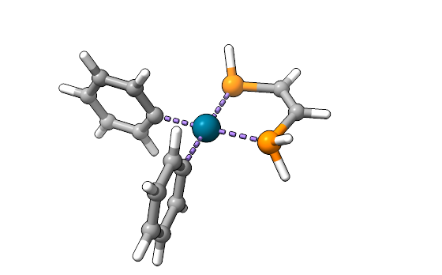
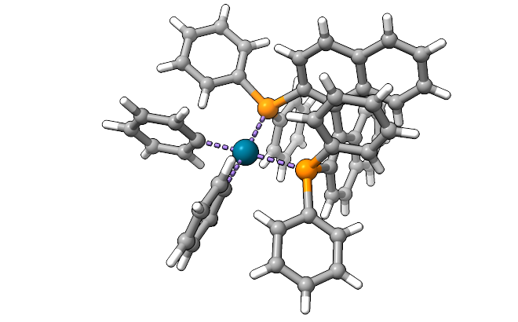
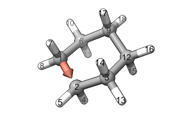
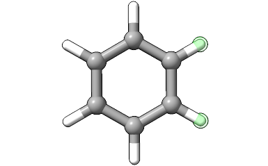
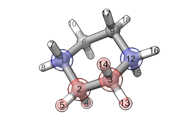
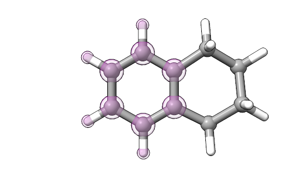

AaronTools Libraries
========================

AaronTools libraries contain various molecular fragments that can be used for building and editing structures.

You can browse the AARON and AaronTools libraries at http://qchasm.wheelergroupresearch.com/ or with SEQCROW's Browse AaronTools Libraries tool. 

The default AaronTools library location is ~/Aaron_lib, though this can be changed with the AARONLIB environment variable.
The library directory should contain several subdirectories, including Subs, Ligands, and Rings.

Substituents
------------

AaronTools includes a library of ~45 substituents, which are fragments with one bond to a molecule (`e.g.` phenyl).
These can be added to a structure or used to replace an existing substituent.
This can be done with the :code:`substitute.py` command line script, or with the :py:func:`Geometry.substitute` method.
Substituents can also be used as monodentate ligands for various ligand-related features in AaronTools.

Substituents can be added to the library using the :code:`libaddSubstituent.py` command line script or SEQCROW's "Add to Personal Library" tool.

It is worth noting that substituents can be fetched from RDKit or the CACTUS web API.
With this, substituents can be used without added them to the library.
For more information, look at :code:`substitute.py --help` or :py:func:`Substituent.from_string`.

Ligands
-------

Ligands can be used to replace another ligand on a structure.
Swapping ligands can be done with the :code:`mapLigand.py` command line script, or with :py:func:`Geometry.map_ligand`.

For example, we can take a relatively simple catalyst structure: 

and swap the ligand for one of the 30-some other diphosphine ligands in the AaronTools library, (R)-BINAP: 

Ligands can be added to the library using the :code:`libaddLigand.py` command line script or SEQCROW's "Add to Personal Library" tool.

Rings
-----

Rings that can be used to close an incomplete ring.
Closing rings can be done with the :code:`closeRing.py` command line script, or with :py:func:`Geometry.ring_substitute`.

Rings can be added to the library using the :code:`libaddRing.py` command line script or SEQCROW's "Add to Personal Library" tool.

To better understand how rings are attached to molecules, consider this example.
Say you want to make tetralin from your benzene structure using the library's cyclohexane ring below (note - a cyclohexene ring might produce a better structure): 

The arrow indicates where to start and which direction to go when traversing the ring. 

You would select two target hydrogen atoms that are ortho to each other: 

Between these two hydrogen atoms, there are two carbon atoms.
Therefore, the total path from one target atom to the other is four atoms long.
AaronTools will find a path around the cyclohexane ring that is four atoms long and starts with atom 1 and atom 2.
Thus, AaronTools will find the path atom 1 → 2 → 3 → 12.
The first and last atoms in this path will replace the targeted hydrogen atoms on the original benzene structure.
The middle atoms on the cyclohexane ring (2 and 3) and any hydrogens on them will be deleted.
In the image below, atoms highlighted in red will be deleted, and atoms highlighted in blue will replace atoms on the original benzene structure:

The fusion carbons on the resulting tetralin structure will come from the original benzene structure.
In the tetralin structure shown below, atoms highlighted in purple come from the original benzene structure, whereas non-highlighted atoms come from the cyclohexane ring: 

Rings in the library with names that end with a dot and a number are one of several conformers.
Each conformer of a ring will be tested to try to find the best fit.