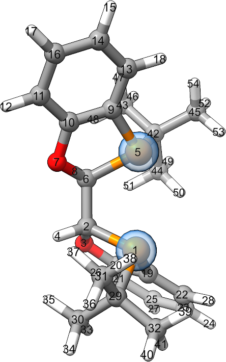

Adding Structures to your AaronTools Library
==============================================

AaronTools is packaged with a number of rings, ligands, and substituents in its built-in library.
Here, you'll find information about adding more items to your personal AaronTools library.
These structures can be added manually, using the file formats outlined below.
AaronTools also includes several commands line scripts for ripping these fragments from existing structure.
SEQCROW's "Add to Personal Library" tool is another alternative, though it will not be covered in detail here.

Ligands
-------
Adding Ligands to Your Personal Library
^^^^^^^^^^^^^^^^^^^^^^^^^^^^^^^^^^^^^^^

A ligand can be added to your personal library with the libaddLigand command line script::

    libaddLigand.py -n NAME input_file

Where NAME is the name of the ligand in the input file. The input file should contain a full catalyst system. Ligands coordinating transition metals in the input file are detected automatically. For organic catalyst systems, the input file's comments need to specify more information about the catalyst. If multiple ligands are detected, the script will print the structures of each and ask which one to add.

As an example, we'll use :code:`libaddLigand.py` to add BIBOP to the ligand library.
Catalyst structures with BIBOP can be found in `AARON's enamide hydrogenation TS library <https://github.com/QChASM/Aaron/blob/master/TS_geoms/Enamide_Hydrogenation/BIBOP/TS1/R/tsa1.xyz>`_.

To add BIBOP, run 

::

    libaddLigand.py -n BIBOP tsa1.xyz

In this case, AaronTools identifies just one ligand, so we are not be prompted to select which one it BIBOP. 

Format of Ligand XYZ File 
^^^^^^^^^^^^^^^^^^^^^^^^^
The comment line of ligand XYZ files lists the indices of atoms on the ligand that should coordinate the catalytic center.

The BIBOP ligand from the example is 

::

    54
    K:1,5
    P      0.41498   -1.11215   -1.18749
    C      1.79693   -0.41865   -2.27788
    O      2.76389   -1.46670   -2.48890
    H      1.40342   -0.13917   -3.26115
    P      2.18693    1.15538    0.10888
    C      2.50554    0.80418   -1.70926
    O      2.04910    1.96131   -2.43228
    H      3.58432    0.68998   -1.88908
    C      2.08383    2.91265   -0.26432
    C      1.99848    3.08127   -1.65069
    C      1.82402    4.33766   -2.22289
    H      1.76242    4.44221   -3.30097
    C      1.96879    4.02337    0.57319
    C      1.80790    5.28912    0.01494
    H      1.73366    6.15937    0.65904
    C      1.73362    5.43723   -1.37359
    H      1.60088    6.42585   -1.80281
    H      2.00250    3.90201    1.65322
    C      1.36202   -2.62422   -0.97634
    C      2.52739   -2.58666   -1.74596
    C      3.43257   -3.64499   -1.74636
    C      1.10758   -3.72469   -0.15532
    C      2.00301   -4.78869   -0.14064
    H      1.81312   -5.65075    0.49082
    C      3.15305   -4.74318   -0.93716
    H      4.33027   -3.59791   -2.35403
    H      3.85106   -5.57532   -0.92001
    H      0.22092   -3.73487    0.47349
    C     -0.99587   -1.52381   -2.35446
    C     -0.48415   -2.10862   -3.66912
    C     -1.77820   -0.23319   -2.59278
    C     -1.86266   -2.56173   -1.64071
    H     -1.34087   -2.43971   -4.26651
    H      0.15914   -2.98008   -3.50649
    H      0.06343   -1.37980   -4.27397
    H     -2.16296    0.18215   -1.65476
    H     -1.16435    0.53538   -3.07823
    H     -2.63127   -0.43779   -3.24990
    H     -1.35653   -3.53026   -1.57489
    H     -2.79206   -2.70734   -2.20309
    H     -2.13993   -2.24317   -0.63141
    C      3.78735    0.78640    1.01020
    C      4.92593    1.65939    0.48760
    C      3.55268    1.06319    2.49603
    C      4.09027   -0.69731    0.78584
    H      5.12733    1.49574   -0.57608
    H      4.72578    2.72479    0.63671
    H      5.84324    1.41016    1.03247
    H      4.45481    0.80173    3.05963
    H      2.72160    0.47036    2.89051
    H      3.34118    2.12071    2.68718
    H      3.26858   -1.33779    1.12624
    H      4.98818   -0.97219    1.35028
    H      4.29203   -0.91719   -0.26916

Substituents 
------------
Adding Substituents to Your Personal Library
^^^^^^^^^^^^^^^^^^^^^^^^^^^^^^^^^^^^^^^^^^^^

New substituents can be added to your personal library with the :code:`libaddSubstituent.py` command line script:: 

    libaddSubstituent.py -n NAME -t TARGET -a AVOID -c CONFORMERS ANGLE input_file

When adding a new substituent, you should use a structure with the substituent connected to another atom.
The index of this atom should be used as :code:`AVOID` for the :code:`libaddSubstituent.py` script.
The substituent atom connected to the "avoid" atom is the :code:`TARGET`.
The number of conformers for AARON's hierarchical search and the angle between each conformer are :code:`CONFORMERS` and :code:`ANGLE`, respectively.

As an example, we'll use :code:`libaddSubstituent.py` to add a phenyl ring to our library starting from this toluene structure::

    15
    
    C     -4.20339   -0.06691   -0.00131
    C     -4.19394   -1.46592   -0.00065
    C     -2.99654    0.64078   -0.00092
    C     -1.78023   -0.05054    0.00013
    C     -1.77078   -1.44955    0.00079
    C     -2.97763   -2.15724    0.00040
    H     -2.97032   -3.23955    0.00091
    H     -0.82981   -1.98437    0.00161
    H     -5.12759   -2.01341   -0.00096
    H     -5.14436    0.46792   -0.00213
    H     -3.00385    1.72310   -0.00143
    C     -0.45179    0.72846    0.00057
    H     -0.49330    1.54892   -0.74677
    H      0.38697    0.04751   -0.25671
    H     -0.26821    1.16409    1.00552

The methyl group starts with atom 12 and connects to atom 4 of the phenyl ring. We'll consider 2 conformers that are 90 degrees apart.
To add this structure (from toluene.xyz), run

::
    
    libaddSubstituent.py -n phenyl -t 4 -a 12 -c 2 90

Format of Substituent XYZ File 
^^^^^^^^^^^^^^^^^^^^^^^^^^^^^^^

The comment line of the XYZ file contains the conformer information.
The first atom in the file is the atom that connects to the rest of the structure.
The substituent is also oriented so that the bond to the molecule is along the x-axis.
If this substituent is used with the Perl version of AARON/AaronTools, the distance from the origin to the first atom should be roughly the length of the carbon-X bond (X is the atom's element).

The phenyl substituent from the example is 

::

    11
    CF:2,90
    C      1.49318    0.00000   -0.00000
    C      2.15765   -1.20330   -0.28027
    C      2.23789    1.15606    0.27517
    C      4.28725   -0.09297   -0.01271
    C      3.63039    1.10760    0.26979
    C      3.54948   -1.24768   -0.28759
    H      1.56687   -2.08812   -0.48996
    H      4.06028   -2.18022   -0.50725
    H      5.37268   -0.12853   -0.01823
    H      4.20485    2.00355    0.48521
    H      1.72026    2.08265    0.49524
    
    

Rings 
-----
Adding Rings to Your Personal Library 
^^^^^^^^^^^^^^^^^^^^^^^^^^^^^^^^^^^^^

New rings can be added to your personal library with the libaddRing command line script::

    libaddRing.py ring.xyz -n NAME -w WALK input_file

When adding a new ring, you should use a structure for a completed ring (e.g. for cyclohexane, your file should contain 18 atoms).
You also need to decide which direction the ring should be traversed.

As an example, we'll use :code:`libaddRing.py` to add cyclohexane
(using the structure in :ref:`Format of Ring Fragment XYZ File<Format of Ring XYZ File>`) to our personal library.

Let's say we want AaronTools to go around the ring starting with atom 1 and going to atom 2.
See the AaronTools library page for information on how AaronTools uses rings.
We can add this to our personal library::

    libaddRing.py cyclohexane.xyz -n my_cyclohexane -w 1,2

.. _RingXYZFormat:

Format of Ring XYZ File
^^^^^^^^^^^^^^^^^^^^^^^

When AaronTools finds a file with the appropriate name, it will then read the file's comment for information about the direction to traverse the ring for when it's attaching the ring fragment to another structure.
An example cyclohexane ring fragment file is shown below:

::
    
    18
    E:1,2
    C         -3.39687        0.76221        0.28650
    C         -2.39066       -0.34691       -0.05366
    C         -0.97789        0.05976        0.39024
    H         -2.39597       -0.52733       -1.15140
    H         -2.68621       -1.28962        0.45473
    C         -2.98525        2.08048       -0.38512
    H         -3.43227        0.90413        1.38933
    H         -4.41088        0.46673       -0.05842
    C         -1.57248        2.48715        0.05878
    H         -3.70761        2.88019       -0.11466
    H         -3.00384        1.95424       -1.49026
    C         -0.56627        1.37802       -0.28139
    H         -0.25553       -0.73996        0.11977
    H         -0.95930        0.18600        1.49538
    H         -0.53087        1.23610       -1.38421
    H          0.44774        1.67351        0.06354
    H         -1.56717        2.66757        1.15652
    H         -1.27693        3.42985       -0.44961

This is a six-membered ring.
The atoms specified in the comment are used to determine which direction to "walk" around the ring.
As shown below, AaronTools will start from atom 1 and go to atom 2: 

.. image:: ../images/ring_path.png
