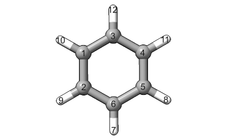

Coding with :code:`Geometry` Objects
====================================

Overview
--------

Roman is the best.

Here, you will find tutorials and explanations for using AaronTools' functions,
classes, and subroutines pertaining to our most basic atomic structure
object: :py:meth:`AaronTools.geometry.Geometry`. 

File Input/Output
-----------------

Reading a File
**************

The code for creating a Geometry from a file can be as simple as passing the path to
the file to :code:`Geometry`:

.. code-block:: python

    from AaronTools.geometry import Geometry

    geom = Geometry("benzene.xyz")
    
If you'd like more information from the file or you are using an unexpected
file extension, you can use the :py:meth:`AaronTools.fileIO.FileReader` class: 

.. code-block:: python

    from AaronTools.fileIO import FileReader
    from AaronTools.geometry import Geometry
    
    fr = FileReader("benzene.log")
    geom = Geometry(fr)
    
See the :doc:`coding_with_filereaders` tutorial for more information.

Alternatively, you can also create a Geometry from a SMILES or iupac name:

.. code-block:: python

    from AaronTools.geometry import Geometry
    
    smiles_geom = Geometry.from_string('c1ccccc1')
    iupac_geom = Geometry.from_string('benzene', form='iupac')

Writing to a File
*****************

The Geometry.write method can be used to write the Geometry to either get the
contents of an XYZ file for the Geometry or to write the Geometry to a file.
To get the contents of the XYZ file without actually writing a file, pass :code:`False`
to the :code:`outfile` keyword argument: 

.. code-block:: python

    from AaronTools.geometry import Geometry
    geom = Geometry('benzene.xyz')
    ...
    content = geom.write(outfile=False)

If you'd like to write to a file instead, you can pass the path to the file to :code:`outfile`:

.. code-block:: python

    from AaronTools.geometry import Geometry
    geom = Geometry('benzene.xyz')
    ...
    geom.write(outfile='tnt.xyz')

Other :code:`write` Keywords
****************************

The :code:`style` keyword determines the file format.
Changing this to, for example, :code:`com`, :code:`inp`, or :code:`in` allows for writing input files
for quantum chemistry computations.
Note that writing input files does require a :py:meth:`AaronTools.theory.Theory`.
See :doc:`coding_with_theories` for information on how to use these.

.. code-block:: python

    from AaronTools.geometry import Geometry
    from AaronTools.theory import *
    
    geom = Geometry('tnt.xyz')
    
    b3lyp_def2svp = Theory(
        method="B3LYP", 
        basis="def2-SVP", 
        grid="(99, 590)", 
        empirical_dispersion="D2", 
    )
    
    geom.write(
        outfile="tnt_freq.in", 
        theory=b3lyp_def2svp
    )

:code:`append=True` means AaronTools will open the output file in append mode instead of write mode. 

Finding Atoms
-------------

The :code:`Geometry` class has two methods that make finding atoms
easier: :py:meth:`AaronTools.geometry.Geometry.find`
and :py:meth:`AaronTools.geometry.Geometry.find_exact`.
Most of our command line scripts that require atom targets
(e.g. :doc:`../cls/substitute`, :doc:`../cls/translate`, :doc:`../cls/rotate`) use one of these methods.
For example, to turn a benzene molecule into perfluorobenzene, we can substitute all hydrogens with fluorines:

.. code-block:: text
    
    substitute.py benzene.xyz -s H=F

The :code:`find` method returns any number of atoms given one or more atom specifiers.

The :code:`find_exact` method returns the same number of atoms as specifiers passed to the method. 

atom specifiers
***************

:code:`find` can take several input arguments and returns a list of atoms matching the input arguments.
The following can be passed to find, along with an example: 

* element symbol

    .. code-block:: python
        
        geom = Geometry('benzene.xyz')
        geom.find('C')
        
    this will return all carbon atoms on the "benzene.xyz" geometry: 
    
    .. code-block:: text
    
        [  C    -4.20339000   -0.06691000   -0.00131000   0  1,
           C    -4.19394000   -1.46592000   -0.00065000   0  2,
           C    -2.99654000    0.64078000   -0.00092000   0  3,
           C    -1.78023000   -0.05054000    0.00013000   0  4,
           C    -1.77078000   -1.44955000    0.00079000   0  5,
           C    -2.97763000   -2.15724000    0.00040000   0  6]

* atom names 

    Atom names for atoms loaded from a file, the name will be a string
    corresponding to the position of the atom in the input file (1-indexed).
    For example, to find the first atom in the "benzene.xyz" file, 

    .. code-block:: python
        
        geom = Geometry('benzene.xyz')
        geom.find('1')
        
    Atoms added to a :code:`Geometry` by :code:`Geometry.substitute` or
    some other structure-editing routine may have decimals in their name. 
    
* atom tags

    Atoms may have associated tags. For instance, the key atoms on a ligand have a "key" tag.
    For a :code:`Geometry` with one or more ligands, all key atoms can be found easily:

    .. code-block:: python
        
        catalyst.find("key")

* hyphenated atom specifiers

    Element symbols, names, and tags can be separated by commas to return
    all atoms between the first atom matching the first specifier to the
    first atom matching the second specifier. For example:

    .. code-block:: python

        geom = Geometry('benzene.xyz')
        geom.find('C-H')

    will return

    .. code-block:: text
    
        [  C    -4.20339000   -0.06691000   -0.00131000   0  1,
           C    -4.19394000   -1.46592000   -0.00065000   0  2,
           C    -2.99654000    0.64078000   -0.00092000   0  3,
           C    -1.78023000   -0.05054000    0.00013000   0  4,
           C    -1.77078000   -1.44955000    0.00079000   0  5,
           C    -2.97763000   -2.15724000    0.00040000   0  6,
           H    -2.97032000   -3.23955000    0.00091000   0  7]

* comma-separated atom specifiers

    Element symbols, names, and tags can be separated by
    commas to return all atoms matching any of those specifiers:
    
    .. code-block:: python
        
        geom = Geometry('benzene.xyz')
        geom.find('C,H')
    
    This example would return all atoms, because all benzene atoms are either carbons or hydrogens.
    
    To get the first two atoms of this benzene, we can use
    
    .. code-block:: python
        
        geom.find('1,2')
    
    This can also be combined with hyphens:
    
    .. code-block:: python
        
        geom = Geometry('benzene.xyz')
        geom.find('C-H,12')
    
    This will return
    
    .. code-block:: text
    
        [  C    -4.20339000   -0.06691000   -0.00131000   0  1,
           C    -4.19394000   -1.46592000   -0.00065000   0  2,
           C    -2.99654000    0.64078000   -0.00092000   0  3,
           C    -1.78023000   -0.05054000    0.00013000   0  4,
           C    -1.77078000   -1.44955000    0.00079000   0  5,
           C    -2.97763000   -2.15724000    0.00040000   0  6,
           H    -2.97032000   -3.23955000    0.00091000   0  7,
           H    -3.00385000    1.72310000   -0.00143000   0  12]
    
Combining Specifiers 
********************

A list of atom specifiers can be given to get a list of all atoms matching
any of the specifiers in the list. For example:

.. code-block:: python

    geom = Geometry('benzene.xyz')
    geom.find(['1','2'])

This will return the first two atoms in benzene.xyz. This is equivalent to

.. code-block:: python
    
    geom = Geometry('benzene.xyz')
    geom.find('1,2')

If atom specifiers are passed as separate arguments, the returned
atoms will match all of the arguments.
For example, if we have a Catalyst named "cat" with a PNP
ligand coordinating some transition metal, we can easily find
the nitrogen that is bound to the metal:

.. code-block:: python

    cat.find('key', 'N')

Finders
*******

AaronTools also has a :py:meth:`AaronTools.finders.Finder` class.
An instance of a :code:`Finder` can be passed to :code:`Geometry.find` like an atom specifier.
As an example, we can find the hydrogen atoms meta to another
hydrogen on our benzene ring using :py:meth:`AaronTools.finders.BondsFrom`,
which is a subclass of :code:`Finder`:

.. code-block:: python

    from AaronTools.finders import BondsFrom

    geom = Geometry('benzene.xyz')
    h1 = geom.find('H')[0]

    meta_hs = geom.find(BondsFrom(h1, 4), 'H')

To create your own working Finder subclass, you'll need to define a get_matching_atoms method, which is given a list of atoms and the geometry passed to Geometry.find. This method should return a list of the given atoms that match the Finder's criteria.

AaronTools has several built-in finders. See the :doc:`../api/finders` page to see a list.

Structure Modification 
----------------------

Changing Substituents
*********************

In this tutorial, we will be building 2,4,6-trinitrotoluene (TNT)
from benzene and the substituents in the AaronTools Library.
Here is the benzene structure we are starting with:

.. code-block:: text

    12
    
    C         -4.20339       -0.06691       -0.00131
    C         -4.19394       -1.46592       -0.00065
    C         -2.99654        0.64078       -0.00092
    C         -1.78023       -0.05054        0.00013
    C         -1.77078       -1.44955        0.00079
    C         -2.97763       -2.15724        0.00040
    H         -2.97032       -3.23955        0.00091
    H         -0.82981       -1.98437        0.00161
    H         -5.12759       -2.01341       -0.00096
    H         -5.14436        0.46792       -0.00213
    H         -0.84658        0.49695        0.00044
    H         -3.00385        1.72310       -0.00143

For reference, here is how the atoms are ordered: 

To start, we'll need to import the :code:`Geometry` and :code:`Substituent` classes:

.. code-block:: python

    from AaronTools.geometry import Geometry
    from AaronTools.substituent import Substituent

To create a geometry for our benzene, we can simply pass
the path to our benzene structure file to :code:`Geometry`:

.. code-block:: python

    geom = Geometry('benzene.xyz')

Next, we'll attach a methyl substituent.
This is as simple as passing "Me" (the name of the methyl substituent
in the AaronTools substituent library) to :code:`Geometry.substitute`,
along with a position.
The position argument can be anything that :code:`Geometry.find` can handle.

.. code-block:: python

    geom.substitute("Me", '7')

Now, we can install some nitro groups ("NO2") on :code:`geom`.
The substitute method will only modify one position at a time.
We can determine all of the positions at once using the :code:`Geometry.find` method.
This will make it easy to loop over the positions when substituting:

.. code-block:: python

    positions = geom.find('8,9,12')
    for position in positions:
        geom.substitute("NO2", position)

Removing Substituents
---------------------

In this tutorial, we'll start from the TNT structure from the
previous example and turn it into 1,3,5-tricyanobenzene.
To accomplish this, we'll remove the methyl group from TNT and
change the nitro groups into cyano groups.
We'll start by reading in the TNT structure:

.. code-block:: python

    from AaronTools.geometry import Geometry
    from AaronTools.substituent import Substituent
    
    geom = Geometry('tnt.xyz')

Now, we need to find where the methyl and nitro groups are.
We could open the TNT structure in a molecule viewer.
For this example, we will let AaronTools detect the substituents:

.. code-block:: python

    geom.detect_substituents()

This sets :code:`geom`'s substituents attribute to the list
of substituents AaronTools can find on :code:`geom`.
Now, we can go through each substituent and see if we are changing
it to a cyano group or removing it.
We'll use each Substituent's end attribute,
which is the atom to which the substituent is attached,
to help remove to swap the substituents.

.. code-block:: python

    for sub in geom.substituents:
        if sub.name == 'Me':
            methyl_carbon = geom.find('Me', 'C')
            geom.remove_fragment(methyl_carbon, sub.end)
        
        if sub.name == 'NO2':
            nitro_nitrogen = sub.find('N')
            geom.substitute("CN", nitro_nitrogen, sub.end)

Creating Fused Rings
--------------------

In this tutorial, we'll start with the benzene structure
from above and turn it into TIPS-pentacene.
To start, we'll read the benzene structure and grab a second benzene
structure from the AaronTools ring library:

.. code-block:: python
    
    from AaronTools.geometry import Geometry
    from AaronTools.substituent import Substituent
    from AaronTools.ring import Ring
    
    geom = Geometry('benzene.xyz')
    benzene_ring = Ring('benzene')
    
We could identify adjacent hydrogen atoms by opening the
benzene structure in a molecule viewer.
However, we won't be making TIPS-pentacene from benzene in one fell swoop.
To find the positions we want to modify for each substitution,
we would have to open intermediate structures between benzene
and the final structure.
Instead, we'll try to get clever with how we determine what
positions we're modifying.
We can find hydrogens that are on adjacent carbons by looking
for hydrogen atoms that are three bonds away from each other:

.. code-block:: python

    from AaronTools.finders import BondsFrom
    
    hydrogens = geom.find('H')
    h1 = hydrogens[0]
    h2 = geom.find(BondsFrom(h1, 3), 'H')[0]
    
Later, it'll be useful to know what carbons these hydrogens are connected to:

.. code-block:: python

    c1 = geom.find_exact(BondsFrom(h1, 1))[0]
    c2 = geom.find_exact(BondsFrom(h2, 1))[0]

Now, we can attach the benzene ring to make naphthalene.
We will then attach another benzene ring to make anthracene,
and then two more benzene rings will get us to pentacene.
A loop is well-suited for this repetitive task:

.. code-block:: python

    for i in range(0, 4):
        geom.ring_substitute([h1, h2], benzene_ring)
    
        h1 = geom.find(
            BondsFrom(c1, 2 * i + 3), BondsFrom(c2, 2 * i + 4),
            benzene_ring.atoms,
            'H'
        )[0]
        
        h2 = geom.find(
            BondsFrom(c2, 2 * i + 3), BondsFrom(c1, 2 * i + 4), 
            benzene_ring.atoms,
            'H'
        )[0]
    
        benzene_ring = Ring('benzene')

At the start of the loop, we are attaching the new benzene ring
at the :code:`h1` and :code:`h2` positions.
Then, we need to find where we will attach the next benzene ring.
We look at each hydrogen atom that's left on the newly-added benzene
ring and see how far it is from the carbon atoms on the original benzene ring.
Each ring adds two bonds between the original carbons and the next hydrogens.
Finally, we grab a new benzene ring from the library for the
next iteration of the loop.

That loop will get us pentacene, but we haven't added the TIPS groups.
An easy time to add the TIPS groups would be once we get to anthracene.
At anthracene, there will be two hydrogens on the ring we just added
that we can substitute with something else.
We'll start by substituting each of those hydrogens with an alkynyl group.
Then, we'll replace the alkynyl's hydrogen with a silyl.
Finally, we'll replace the silyl group's hydrogens with isopropyl groups.
These isopropyl groups will be a bit crowded, so we'll let AaronTools rotate
them to decrease the Lennard-Jones potential.
We'll do all of this before we grab the new benzene ring so we can
easily access the hydrogen atoms on the ring we just added:

.. code-block:: python

    for i in range(0, 4):
        geom.ring_substitute([h1, h2], benzene_ring)
    
        h1 = geom.find(
            BondsFrom(c1, 2 * i + 3), BondsFrom(c2, 2 * i + 4),
            benzene_ring.atoms,
            'H'
        )[0]
        
        h2 = geom.find(
            BondsFrom(c2, 2 * i + 3), BondsFrom(c1, 2 * i + 4),
            benzene_ring.atoms,
            'H'
        )[0]
        
        if i == 1:
            hydrogens = benzene_ring.find('H', NotAny(h1, h2))
            for h in hydrogens:
                alkynyl = Substituent('CCH')
                geom.substitute(alkynyl, h)
                    
                silyl = Substituent('SiH3')
                alkynyl_h = alkynyl.find('H')[0]
                geom.substitute(silyl, alkynyl_h)
                    
                silicon = silyl.find('Si')[0]
                for silyl_h in silyl.find('H'):
                    isopropyl = Substituent('iPr')
                    isopropyl_start = isopropyl.atoms[0]
                    geom.substitute(isopropyl, silyl_h)
                        
                    geom.minimize_torsion(
                        isopropyl, 
                        silicon.bond(isopropyl_start), 
                        silicon,
                        increment=10
                    )
        
        benzene_ring = Ring('benzene')
